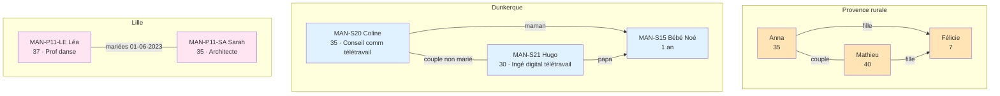
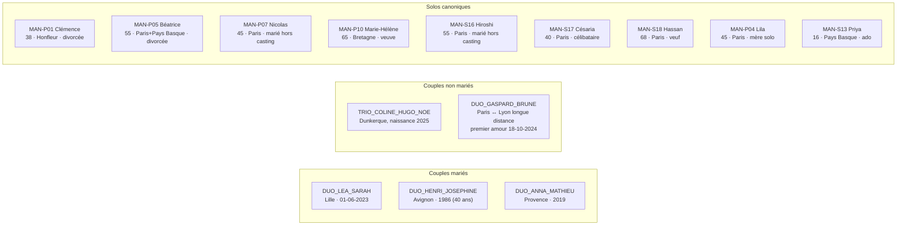
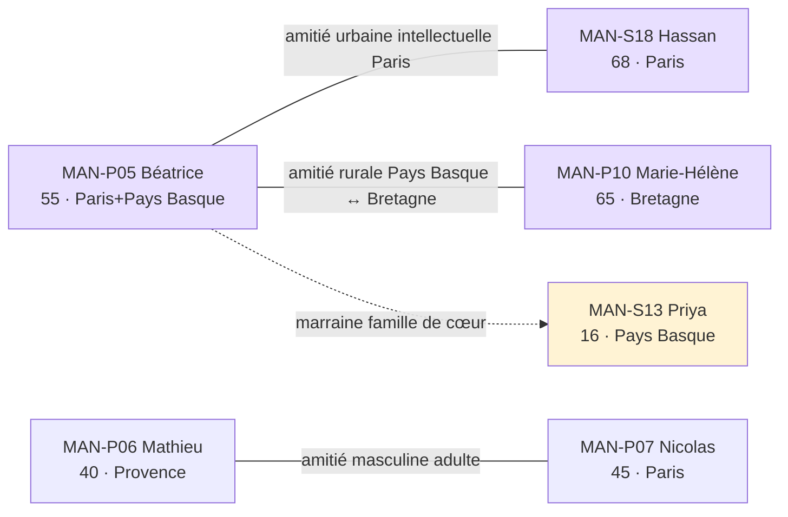
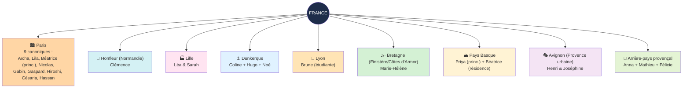

# Casting Ypersoa — Arbre généalogique & cartographie

> Vue d'ensemble visuelle du casting Ypersoa après refonte narrative v3.3 (1er mai 2026).
> Source de vérité : `referentiels/shooting/mannequins_recurrents.json` v3.3 + `referentiels/casting/affinites_narratives.json` v1.1.
>
> Les diagrammes Mermaid se rendent automatiquement dans VSCode (extension preview Markdown), GitHub, et la plupart des outils Markdown modernes.

---

## 1. Vue d'ensemble — 3 lignées familiales sur 3 générations

```mermaid
graph TD
    subgraph LIGNÉE_ROUSSES["🔴 Lignée rousses françaises (Provence/Bretagne)"]
        MH["MAN-P10 Marie-Hélène<br/>65 ans · Bretagne<br/>Veuve, retraitée jardinière"]
        AN["MAN-P02 Anna<br/>35 ans · Provence rurale<br/>Architecte intérieur"]
        MA["MAN-P06 Mathieu<br/>40 ans · Provence rurale<br/>Ingé son freelance"]
        FE["MAN-P08 Félicie<br/>7 ans · Provence rurale<br/>Blonde vénitienne CE2"]
        MH -->|fille| AN
        AN ---|couple 2019| MA
        AN -->|mère| FE
        MA -->|père| FE
    end

    subgraph LIGNÉE_MAGHRÉBINES["🟠 Lignée maghrébines patrilinéaires (Paris)"]
        HA["MAN-S18 Hassan<br/>68 ans · Paris<br/>Veuf, immigré 70s"]
        LI["MAN-P04 Lila<br/>45 ans · Paris<br/>Avocate, mère solo"]
        GA["MAN-P09 Gabin<br/>5 ans · Paris<br/>Jumeau de César*"]
        CE["César*<br/>5 ans · hors casting<br/>(visuellement identique)"]
        HA -->|père| LI
        LI -->|mère solo| GA
        LI -.->|mère solo| CE
        GA -.-|jumeau| CE
    end

    subgraph LIGNÉE_AFROCAR["🟢 Lignée afro-caribéennes (Paris/Avignon)"]
        JO["MAN-S19-JO Joséphine<br/>70 ans · Avignon retraite<br/>Ex-psychanalyste"]
        HE["MAN-S19-HE Henri<br/>72 ans · Avignon retraite<br/>Médecin retraité<br/>(beau-père)"]
        AI["MAN-P03 Aïcha<br/>40 ans · Paris<br/>DA agence/galeriste"]
        CES["MAN-S17 Césaria<br/>40 ans · Paris<br/>Prof de lettres"]
        JO ---|mariée 1986| HE
        JO -->|mère biologique| AI
        JO -->|mère biologique| CES
        HE -.->|beau-père| AI
        HE -.->|beau-père| CES
    end

    style MH fill:#FFE4B5
    style AN fill:#FFE4B5
    style FE fill:#FFE4B5
    style HA fill:#FFD6A5
    style LI fill:#FFD6A5
    style GA fill:#FFD6A5
    style CE fill:#FFD6A5,stroke-dasharray: 5 5
    style JO fill:#D4F1D4
    style HE fill:#D4F1D4
    style AI fill:#D4F1D4
    style CES fill:#D4F1D4
```

\* César est hors casting mais visuellement identique à Gabin. Pour les shots fratrie, dupliquer la photo de Gabin via Gemini.

---

## 2. Familles nucléaires & jeune parentalité

---

## 3. Couples & relations qualifiées

---

## 4. Amitiés & familles de cœur

---

## 5. Cartographie régionale du casting

---

## 6. Axes narratifs forts pour storytelling

| Axe narratif | Dispositifs concernés | Pic d'usage commercial |
|---|---|---|
| **Transmission matriarcale** | TRIO_AICHA_CESARIA_JOSEPHINE / TRIO_MARIEHELENE_ANNA_FELICIE / DUO_MARIEHELENE_FELICIE | Fête des mères, Noël famille, anniversaire mamie |
| **Transmission patriarcale** | TRIO_HASSAN_LILA_GABIN / DUO_HASSAN_GABIN / DUO_HASSAN_LILA | Fête des pères, Ramadan, fête des grands-pères |
| **Transmission rousseur visuelle** | TRIO_MARIEHELENE_ANNA_FELICIE | Signature visuelle Ypersoa, fête des mères, Noël |
| **Couple-fait-pas-statement** | DUO_LEA_SARAH | Saint-Valentin, anniversaire mariage |
| **Long amour senior** | DUO_HENRI_JOSEPHINE | 40 ans mariage, Saint-Valentin senior, Noël |
| **Mère solo CSP+** | DUO_LILA_GABIN | Fête des mères "mère solo", anniversaire fils |
| **Famille de cœur** | DUO_BEATRICE_PRIYA | Anniversaire filleule, transmission non-génétique |
| **Jeune parentalité** | TRIO_COLINE_HUGO_NOE / DUO_HUGO_NOE | Naissance, premier Noël bébé, fête des pères jeune |
| **Couple longue distance** | DUO_GASPARD_BRUNE | Saint-Valentin jeune, premier anniversaire couple |
| **Famille nucléaire rurale** | TRIO_ANNA_MATHIEU_FELICIE | Fête des mères/pères Provence, vacances famille |
| **Girl gang multiculturel** | TRIO_COPINES_ANNA_AICHA_LILA | EVJF, weekend amies, anniversaire amie |
| **Amitié senior éclairée** | DUO_BEATRICE_HASSAN | Amitié aînés non romantique, Noël amis |

---

## 7. Solo canoniques sans famille de sang dans le casting

| Mannequin | Profil narratif | Lien optionnel |
|---|---|---|
| **MAN-P01 Clémence** | Antiquaire Honfleur, divorcée libération, mère d'un fils 16 ans (hors casting) | Affinités latentes : amitié intergén Marie-Hélène (transmission savoir-faire-femmes) |
| **MAN-P05 Béatrice** | Notaire retraitée, divorcée, marraine de Priya | DUO_BEATRICE_HASSAN, DUO_BEATRICE_MARIEHELENE, DUO_BEATRICE_PRIYA |
| **MAN-P07 Nicolas** | Mari attentionné classique, marié hors casting, sans enfant canonique | DUO_MATHIEU_NICOLAS |
| **MAN-S16 Hiroshi** | Architecte japonais, marié à Française non-canonique, ados hors casting | Affinité latente avec Priya |

---

## 8. Métadonnées techniques

- **Total entrées canoniques** : 21 (22 individus, MAN-P11 = couple Léa+Sarah)
- **Lignées familiales 3 gen** : 3 (rousses, maghrébines, afro-caribéennes)
- **Dispositifs établis** : 19 (12 duos + 7 trios)
- **Affinités latentes** : 4
- **Régions/villes représentées** : 9 (Paris, Honfleur, Lille, Dunkerque, Lyon, Bretagne, Pays Basque, Avignon, Provence rurale)
- **Couples longue distance** : 1 (Gaspard Paris ↔ Brune Lyon)
- **Hors casting cités** : César (jumeau de Gabin, visuellement identique), femmes/maris non-canoniques de Mathieu (RIP), Nicolas, Hiroshi, parents de Priya, mère de Félicie d'avant Anna n/a, ex-compagnon de Lila

---

## 9. À valider Sarah au matin du 02-05-2026

- [ ] Toutes les **dates de naissance** (DD-MM-YYYY) du `calendrier_canoniques.json`
- [ ] Tous les **événements de vie** des 21 mannequins
- [ ] Toutes les **affinités qualifiées** entre mannequins
- [ ] **Cartographie régionale** : OK ou ajustement (autres villes ?)
- [ ] **Question résiduelle "jumeaux Lila"** : César est-il définitivement hors casting visuellement identique, ou faut-il l'ajouter comme MAN-P09b ?

---

## 10. Liens

- Source mannequins : [referentiels/shooting/mannequins_recurrents.json](../referentiels/shooting/mannequins_recurrents.json) (v3.3)
- Source affinités : [referentiels/casting/affinites_narratives.json](../referentiels/casting/affinites_narratives.json) (v1.1)
- Source calendrier : [referentiels/casting/calendrier_canoniques.json](../referentiels/casting/calendrier_canoniques.json) (v1.1)
- Source duos détaillés (direction photo) : [referentiels/shooting/duos_detailles_et_distribution.json](../referentiels/shooting/duos_detailles_et_distribution.json) — **à mettre à jour en v3.3 plus tard** (renommer DUO_BEATRICE_FELICIE → DUO_MARIEHELENE_FELICIE etc.)
- Spec query : [_passations/IDEES_FUTURES/SPEC_casting_intelligence.md](IDEES_FUTURES/SPEC_casting_intelligence.md)
